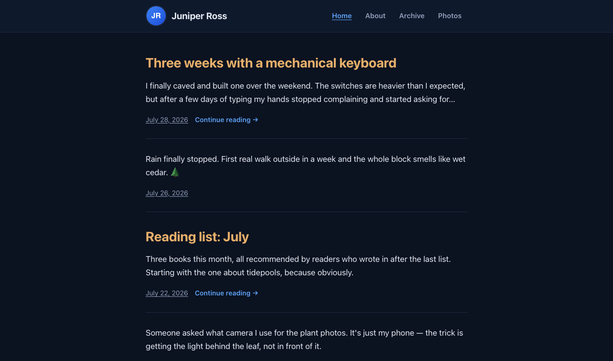

# Cobalt



A clean, modern [Micro.blog](https://micro.blog) theme in blue, dark by design (no light mode). Avatar and site title on the left of a compact header, navigation on the right, and a simple footer. Includes IndieWeb microformats (h-card, h-entry) for webmentions and cross-posting.

## Using this theme on Micro.blog

1. Push this repository to a public GitHub repo (e.g. `github.com/yourname/cobalt-theme`).
2. In Micro.blog, go to **Design → Edit Custom Themes → New Theme**.
3. Point it at your GitHub repo and save. Micro.blog will pull in `layouts/` and `static/` from this repo.
4. Set your avatar, site title, and navigation links from the normal Micro.blog **Design** and **Preferences** screens — the theme reads all of that automatically:
   - Avatar & name → `.Site.Author.avatar` / `.Site.Author.name`
   - Site title → `.Site.Title`
   - Nav links → the "main" menu (Design → Navigation)
   - Extra footer links (optional) → a "footer" menu

The header intentionally has no tagline/bio line — just the avatar, title, and nav.

**Important:** Micro.blog merges this repo's `config.json` directly into your live site's config, and its values take precedence over your real dashboard settings for anything under `title`, `author`, `params.description`, or `menu`. That's why `config.json` here deliberately omits all of those — don't add them back (not even as placeholders), or you'll overwrite your real title and author info with whatever you typed in this file. `config.json` should only ever contain this theme's own custom settings (the `cobalt_*` params below), never anything Micro.blog's dashboard already manages.

## Theme settings

`plugin.json` declares a settings form that appears on the theme's page in Micro.blog's dashboard (Design → your theme → Settings), grouped in the order they naturally affect a post — how much text shows, how many posts per page, then the reading-time/category extras, then custom code:

**Post content**
- **Show full post text on the home and archive pages** — a checkbox. Off by default, which shows an excerpt instead. Untitled, short microblog-style posts always show in full either way, since there's nothing to excerpt.
- **Excerpt length, in characters** — only used when the checkbox above is off. Defaults to 280 if left blank.
- **Number of posts to display per page** — maps to Hugo's site-wide `paginate` setting (the same field Micro.blog's own official "Paginate settings" plugin uses). Defaults to 20.

**Reading time & categories**
- **Show estimated reading time on posts** — on by default. Uncheck to hide the "N min read" next to the date.
- **Show category pills on posts** — on by default. Uncheck to hide the category pills under each post.
- **Only show category pills on long posts** — off by default (pills show on every post). When checked, pills only appear on posts over a minute's reading time; short microblog-style posts won't show them.

**Custom code**
- **Custom code for `<head>`** — raw HTML/JS pasted here is inserted right before `</head>` on every page. Use for analytics snippets, extra meta tags, etc.
- **Custom code before `</body>`** — raw HTML/JS inserted right before the closing `</body>` tag. Use for tracking scripts that should load late.

Both code fields are inserted unescaped (`safeHTML`), so only paste code you trust. The reading-time and category checkboxes default to *on* even before you've touched the settings page — the templates only hide them when explicitly set to off, so an unset/missing value still shows them. The "long posts only" checkbox works the other way (default off), matching how a fresh install behaves today.

## SEO

`layouts/partials/seo.html` (included from `head.html` on every page) adds:

- A self-referencing canonical link, skipped automatically on pages (like `/archive/`) where Micro.blog/Hugo already emits its own `rel="canonical"`, to avoid conflicting duplicates
- A `<meta name="description">` truncated to 160 characters, sourced from the page's own description/summary (or the site description on the home page)
- Open Graph tags, via the dedicated `layouts/partials/opengraph.html` template (site name, type, title, description, url, image + alt, locale, and `article:published_time`/`article:modified_time` on posts)
- Twitter Card tags (title, description, image, card type)
- JSON-LD `BlogPosting` structured data on individual posts (headline, dates, author, url, image)

All of these fall back to your avatar for the image if a post has no `Params.image` set.

The home page also gets a visually-hidden `<h1>` (the site title) for heading-hierarchy correctness, since list and single pages already have a visible one.

## Other pages and features

- **Photos** (`layouts/list.photoshtml.html`) — a responsive grid of every post that has `Params.photos` set, each thumbnail linking to its post, overriding Micro.blog's unstyled built-in photos template the same way the archive page does.
- **Search** — Micro.blog's search page embeds its own `<form>`/`.field`/`#list_results` markup and inline styles directly in the page content, so this theme overrides them with more specific selectors scoped under `.single-content` in `static/css/style.css`.
- **Replies** — posts you make of `Type: "reply"` intentionally don't appear in the home feed, archive, or category pages; that's Micro.blog's own documented behavior (they get their own `/replies` page), not something this theme filters out.
- **Category pills + reading time** — each post in a list (and the post itself on its own page) shows its categories as small pills (via `.GetTerms "categories"`, so it works regardless of how your front matter names the taxonomy field) and a "N min read" estimate for posts over a minute, next to the date. Both are toggleable from the theme settings (see above).
- **Accessibility** — a "Skip to content" link (visible on keyboard focus) jumps past the header/nav straight to `<main>`, and links/buttons/inputs get a visible accent-colored focus ring for keyboard navigation.
- **Print styles** — printing a page hides the header, nav, footer, back-to-top button, and reply thread, and switches to black-on-white for readability on paper.

## Local development

Since `config.json` intentionally has no title/author/description (see above), create an untracked `config.dev.json` alongside it for local preview only:

```json
{
	"title": "Your Site Title",
	"author": { "name": "Your Name", "avatar": "/images/avatar.jpg", "username": "yourusername" },
	"params": { "author": { "name": "Your Name", "avatar": "/images/avatar.jpg", "username": "yourusername" }, "description": "Used only for the <meta name=\"description\"> tag, not shown in the header." },
	"menu": { "main": [ { "name": "About", "url": "/about/", "weight": 1 } ] }
}
```

Then run Hugo with both configs merged (never commit `config.dev.json`):

```
hugo server --config config.json,config.dev.json
```

## Structure

- `layouts/_default/baseof.html` — base page shell (head, header, footer)
- `layouts/partials/header.html` + `navigation.html` — compact single-row header: avatar/title on the left, nav on the right
- `screenshot/home.png` — theme screenshot shown above, referenced from this README for the Micro.blog theme directory
- `layouts/partials/footer.html` — RSS/JSON feed links, copyright
- `plugin.json` — the theme settings form (excerpt vs. full post, custom head/footer code)
- `layouts/partials/seo.html` — canonical link, meta description, Twitter Card tags, JSON-LD for posts
- `layouts/partials/opengraph.html` — Open Graph tags, called from `seo.html`
- `layouts/index.html`, `layouts/_default/list.html` — post lists (home, categories, tags)
- `layouts/list.archivehtml.html` — the `/archive/` page: a full unpaginated post history plus category and year filters, overriding Micro.blog's unstyled built-in archive template
- `layouts/list.photoshtml.html` — the `/photos/` page: a responsive grid of posts with photos
- `layouts/post/single.html`, `layouts/_default/single.html` — individual posts and pages
- `static/css/style.css` — all styling; dark-only, no light theme

## Customizing the color

All colors are CSS custom properties at the top of `static/css/style.css`. Change `--blue-400` / `--blue-500` (the `--accent` / `--accent-hover` values) to shift the accent color.
